# Mermaid Templates — Business Analysis

Gotowe szablony diagramow Mermaid do uzycia w raportach biznesowych `/ultra-biz`.
Wszystkie szablony sa kompatybilne z GitHub Markdown i VS Code preview.

---

## 1. SWOT Analysis — Quadrant Chart

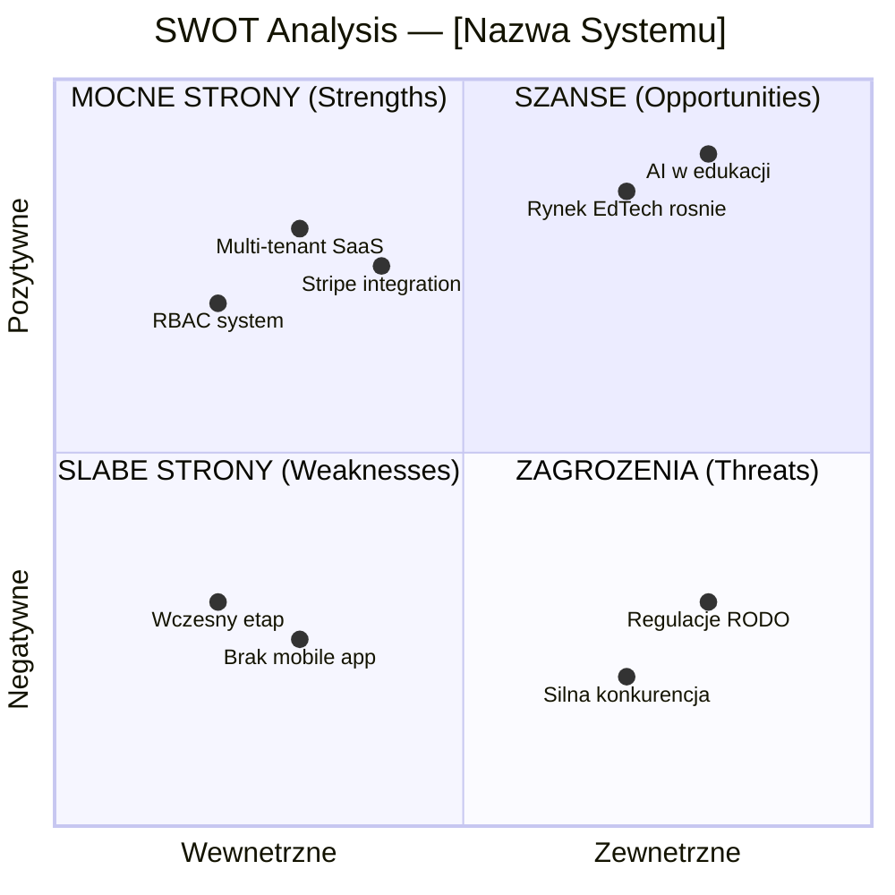

**Uzycie:** Zamien etykiety i wspolrzedne [x, y] na realne dane z analizy.
- x-axis: 0.0-0.5 = wewnetrzne, 0.5-1.0 = zewnetrzne
- y-axis: 0.0-0.5 = negatywne, 0.5-1.0 = pozytywne

---

## 2. Porter's Five Forces — Mindmap

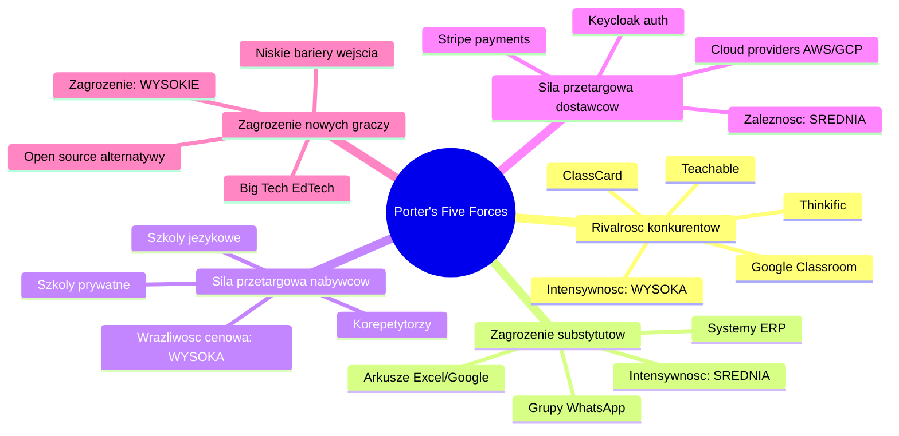

---

## 3. Customer Journey — Journey Diagram

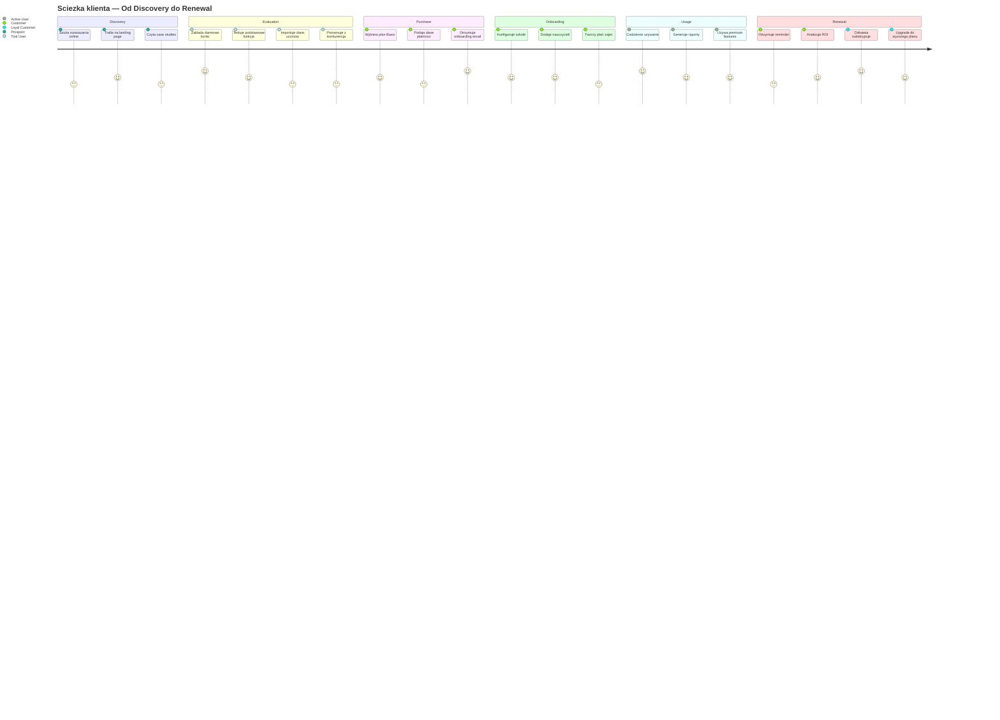

---

## 4. Feature Categorization — Pie Chart

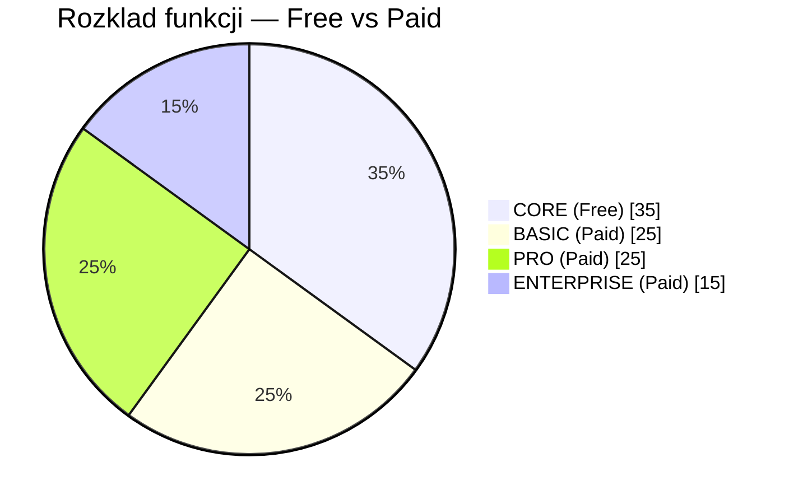

---

## 5. Revenue Projections — XY Chart

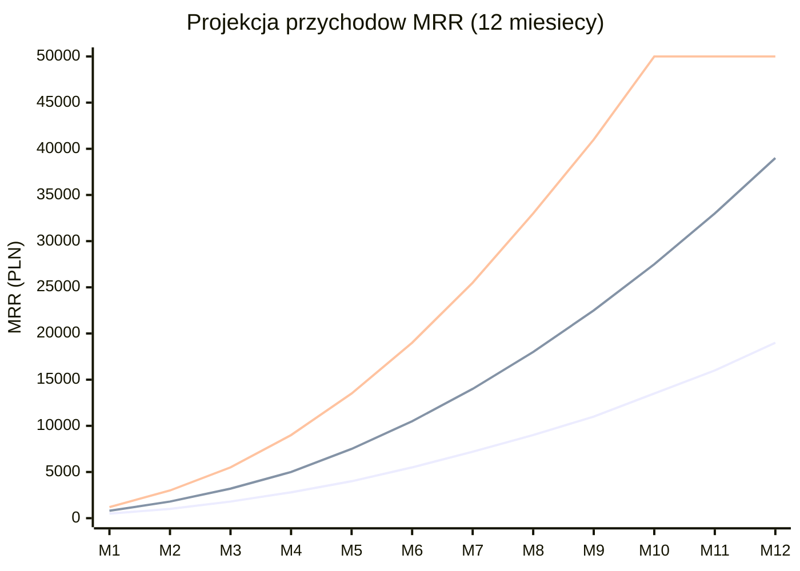

---

## 6. GTM Timeline — Gantt Chart

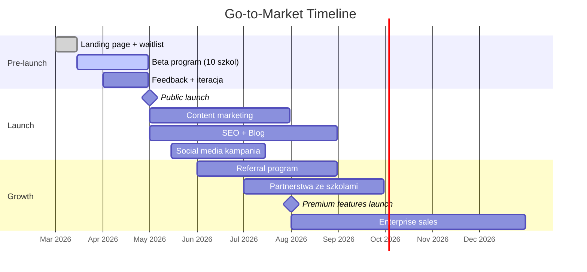

---

## 7. Competitive Landscape — Quadrant Chart

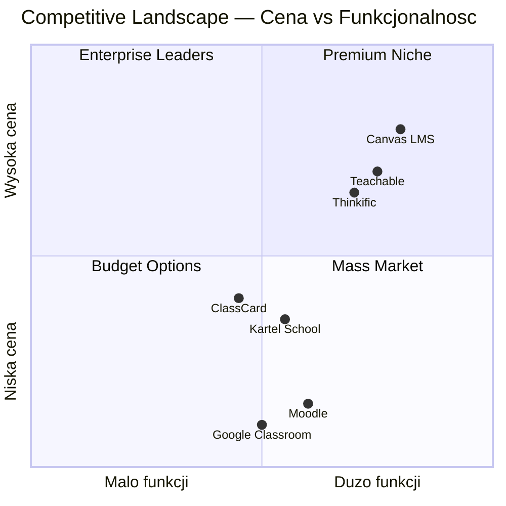

---

## 8. Revenue Flow — Flowchart

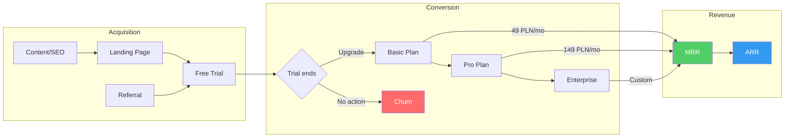

---

## 9. Upsell Path — Flowchart TD

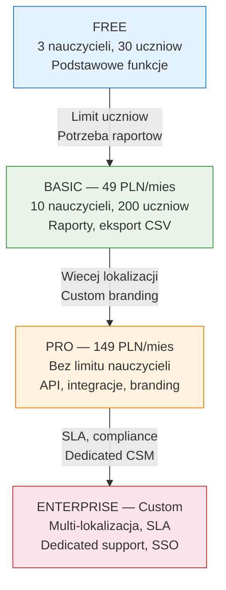

---

## 10. Business Model Canvas — Flowchart

```mermaid
flowchart TB
    subgraph KP["Kluczowi Partnerzy"]
        kp1["Cloud providers"]
        kp2["Stripe payments"]
        kp3["Szkoly partnerskie"]
    end

    subgraph KA["Kluczowe Aktywnosci"]
        ka1["Rozwoj platformy"]
        ka2["Customer support"]
        ka3["Marketing/Sales"]
    end

    subgraph KR["Kluczowe Zasoby"]
        kr1["Zespol dev"]
        kr2["Infrastruktura cloud"]
        kr3["Baza klientow"]
    end

    subgraph VP["Propozycja Wartosci"]
        vp1["All-in-one zarzadzanie szkola"]
        vp2["Multi-tenant, skalowalne"]
        vp3["RODO compliance"]
    end

    subgraph CR["Relacje z Klientami"]
        cr1["Self-service + onboarding"]
        cr2["Chat support"]
        cr3["Community forum"]
    end

    subgraph CH["Kanaly"]
        ch1["Website / SEO"]
        ch2["Social media"]
        ch3["Referral program"]
    end

    subgraph CS["Segmenty Klientow"]
        cs1["Szkoly jezykowe"]
        cs2["Korepetytorzy"]
        cs3["Szkoly prywatne"]
    end

    subgraph COST["Struktura Kosztow"]
        cost1["Hosting + infra"]
        cost2["Zespol (dev + support)"]
        cost3["Marketing"]
    end

    subgraph REV["Strumienie Przychodow"]
        rev1["Subskrypcje miesiczne"]
        rev2["Roczne plany (rabat)"]
        rev3["Enterprise custom"]
    end
```

---

## 11. System Modules — Pie Chart (CORE vs PREMIUM)

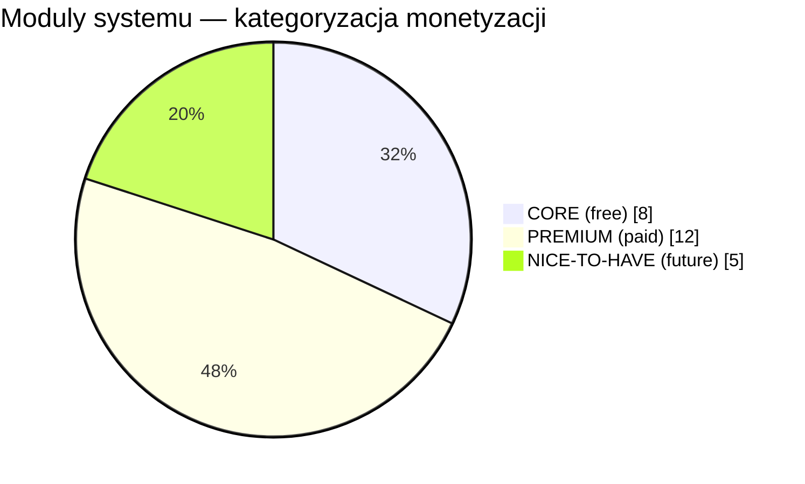

---

## Wskazowki uzycia

1. **ZAWSZE** dostosuj dane do realnych wynikow analizy — szablony sa startowe.
2. **quadrantChart** — wspolrzedne [x, y] w zakresie 0.0-1.0.
3. **xychart-beta** — wymaga Mermaid v10.6+, moze nie renderowac w starszych wersjach.
4. **gantt** — dateFormat i axisFormat musza byc spojne.
5. **journey** — skala 1-5 (1=frustracja, 5=zadowolenie).
6. **pie** — dodaj `showData` aby wyswietlic wartosci liczbowe.
7. **mindmap** — wciecia definiuja hierarchie (2 spacje per level).
8. **flowchart** — uzywaj `subgraph` do grupowania, `style` do kolorow.
