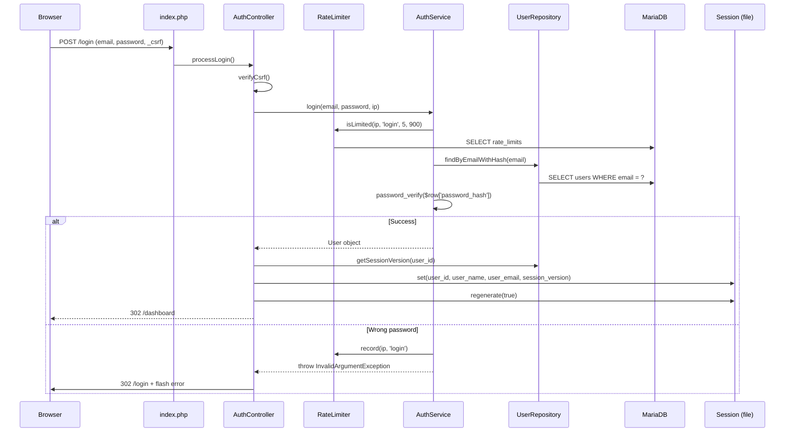
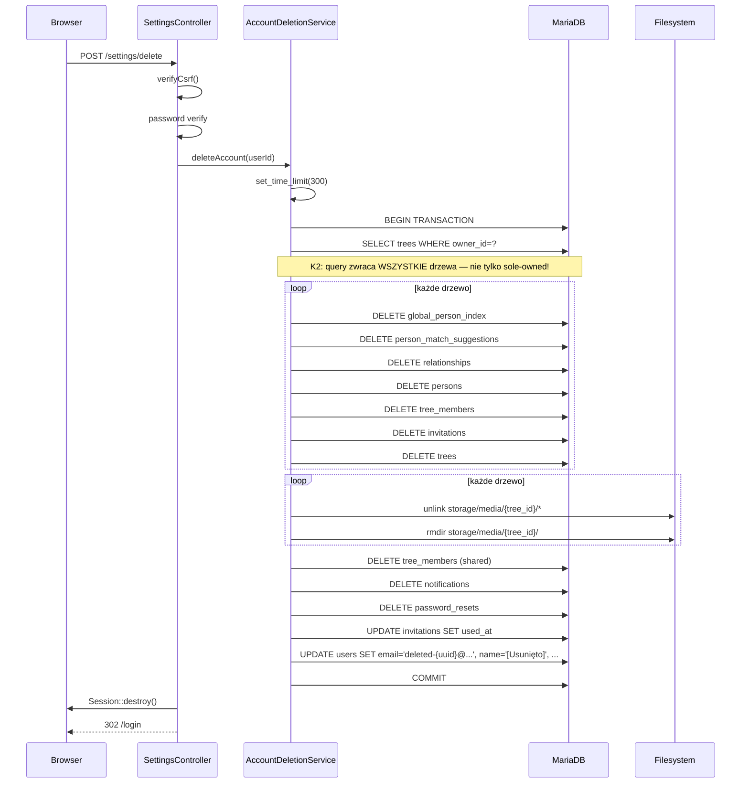

# Audyt architektury — Genealog (backend) — Re-audit #3

**Data:** 2026-04-08

---

## Metryki kodu

| Metryka | Wartość | Ocena |
|---------|---------|-------|
| Controllers | 15 plików, 2697 LOC | ✅ avg 180 LOC |
| Services | 17 plików, 4056 LOC | ⚠️ avg 239 LOC |
| Repositories | 8 plików, 1062 LOC | ✅ avg 133 LOC |
| Core | 13 plików | ✅ |
| Middleware | 2 pliki | ✅ |
| Views | 45 plików | ⚠️ strict_types missing |
| **Łącznie src** | ~8000 LOC | ✅ rozmiar utrzymywalny |
| Migrations | 11 | ✅ incremental |
| Tests | ~5 plików | ❌ ~9% coverage szac. |
| God classes (>500 LOC) | `GedcomService` 775 | ⚠️ odroczone |
| `new X(...)` w `public/index.php` | 56 wystąpień | ❌ DI missing |
| `InvitationController` duplikacja | 3× instantiated | ❌ |
| `DiscoveryController` duplikacja | 2× instantiated | ❌ |
| Cache warstwa | Brak (poza in-request memoize) | ⚠️ |

---

## Component Diagram

```mermaid
graph TD
  subgraph HTTP
    REQ[Browser/Client]
  end

  subgraph Bootstrap
    IDX[public/index.php — 56x new, routing]
  end

  subgraph Middleware
    AUTH_MW[AuthMiddleware]
    ADMIN_MW[AdminMiddleware]
  end

  subgraph Controllers [15 controllers]
    AC[AuthController]
    PC[PersonController]
    TC[TreeController]
    GC[GedcomController]
    DC[DiscoveryController x2]
    SC[SettingsController]
    ADM[AdminController]
    IC[InvitationController x3]
    PRC[ProfileController]
    NC[NotificationController]
    RC[RelationshipController]
    HC[HomeController]
    SGC[SuggestionController]
    APC[ApiController]
  end

  subgraph Services [17 services]
    AuthSvc[AuthService]
    PersonSvc[PersonService]
    TreeSvc[TreeService]
    GedcomSvc[GedcomService — 775 LOC]
    MatchSvc[MatchingService]
    AccDelSvc[AccountDeletionService]
    DataExpSvc[DataExportService]
    SuggSvc[SuggestionService]
    GISvc[GlobalIndexService]
    NotifSvc[NotificationService]
    EmailSvc[EmailService]
    PwdResetSvc[PasswordResetService]
    InvSvc[InvitationService]
    MediaSvc[MediaService]
    RelSvc[RelationshipService]
    AdmSvc[AdminService]
  end

  subgraph Repositories [8 repositories]
    UserRepo[UserRepository]
    PersonRepo[PersonRepository]
    TreeRepo[TreeRepository]
    RelRepo[RelationshipRepository]
    DiscRepo[DiscoveryRepository]
    NotifRepo[NotificationRepository]
    InvRepo[InvitationRepository]
    AdminRepo[AdminRepository]
  end

  subgraph Core
    DB[(Database PDO)]
    RL[RateLimiter]
    ED[EventDispatcher static]
    SESS[Session file]
    CSRF[Csrf]
  end

  subgraph Storage
    MariaDB[(MariaDB 8)]
    FS[storage/media/]
    TMP[/tmp GEDCOM]
    SMTP[SMTP mail]
  end

  REQ --> IDX
  IDX --> AUTH_MW
  AUTH_MW --> ADMIN_MW
  AUTH_MW --> Controllers
  ADMIN_MW --> ADM
  AC --> AuthSvc & PwdResetSvc
  PC --> PersonSvc & SuggSvc
  TC --> TreeSvc
  GC --> GedcomSvc
  DC --> MatchSvc & GISvc
  SC --> AccDelSvc & DataExpSvc
  ADM --> AdmSvc
  IC --> InvSvc
  PRC --> AuthSvc
  NC --> NotifSvc

  DataExpSvc -.->|new GedcomService| GedcomSvc
  MatchSvc -.->|new NotificationService| NotifSvc

  PersonSvc --> PersonRepo & TreeRepo
  AuthSvc --> UserRepo & RL
  TreeSvc --> TreeRepo
  AccDelSvc --> TreeRepo & UserRepo & DB
  MatchSvc --> NotifSvc & GISvc
  GISvc --> DiscRepo
  InvSvc --> InvRepo & UserRepo & EmailSvc
  MediaSvc --> PersonRepo
  PwdResetSvc --> UserRepo & EmailSvc & DB

  UserRepo & PersonRepo & TreeRepo & RelRepo --> DB
  DiscRepo & NotifRepo & InvRepo & AdminRepo --> DB
  DB --> MariaDB

  MediaSvc --> FS
  GC --> TMP
  EmailSvc --> SMTP

  AuthSvc -.-> ED
  PersonSvc -.-> ED
  TreeSvc -.-> ED

  classDef issue fill:#ffdddd,stroke:#ff0000;
  class DataExpSvc,MatchSvc issue;
  class GedcomSvc issue;
```

Czerwone: serwisy instantiujące zależności wewnętrznie (`new`) zamiast DI — blokuje mockowanie w testach.

---

## Sequence Diagram — Login flow



---

## Sequence Diagram — Account Deletion (RODO Art. 17)



**Uwaga K2:** krok `SELECT trees WHERE owner_id=?` nie filtruje drzew współdzielonych — usuwa dane innych userów.

---

## Data Flow Diagram — Trust Boundaries

```mermaid
flowchart LR
  subgraph Internet [Trust boundary: Internet]
    USER[User Browser]
    BOT[Attacker]
    EXT[External: FamilySearch / Geneteka CSV]
  end

  subgraph Process [Trust boundary: PHP process]
    IDX[index.php + Router]
    MW[Auth + Admin Middleware]
    CTL[Controllers]
    SVC[Services]
    REPO[Repositories]
    SESS[Session file]
    TMP[/tmp GEDCOM]
  end

  subgraph Filesystem [Trust boundary: Server FS]
    MEDIA[storage/media/ tree_id/]
    LOGS[/var/log/php]
  end

  subgraph DB [Trust boundary: MariaDB]
    USERS[users]
    PERSONS[persons]
    TREES[trees]
    AUDIT[source_audit_log]
    RESETS[password_resets]
    GI[global_person_index]
  end

  subgraph SMTP_BOUND [Trust boundary: SMTP relay]
    MAILS[mail provider]
  end

  USER -->|HTTPS GET/POST + cookie| IDX
  BOT -.->|spam, SMTP injection, XSS| IDX
  EXT -.->|HTTP API / CSV import| SVC

  IDX --> MW --> CTL --> SVC --> REPO
  REPO -->|PDO prepared| DB

  CTL --> SESS
  SVC -->|move_uploaded_file| TMP
  TMP -.->|P6: leak on exception| TMP
  SVC -->|finfo + webp| MEDIA
  SVC -->|mail headers ❌K1| MAILS
  SVC -->|error_log| LOGS

  DB -.->|data breach? 33 notif| SMTP_BOUND
```

Punkty styku (attack surface):
- **Internet → index.php**: wszystkie routes (mitigation: CSRF, rate limit, session)
- **GEDCOM upload → /tmp**: MIME validation + content check (mitigation: K2 tmp leak)
- **SVC → SMTP**: brak sanitacji `From:` (mitigation: K1)
- **External API → SVC**: FamilySearch OAuth (brak weryfikacji TLS fingerprint?)

---

## Bottlenecks

### B1 — GEDCOM tmp file leak
`src/Controllers/GedcomController.php:114-165`. Przy exception w parsingu, plik `sys_get_temp_dir()` nie jest usuwany. Przy 50MB limicie i częstych błędach — /tmp się zapycha.

**Impact:** Medium. Filesystem pressure, potential monitoring alert spam.
**Fix:** `try/finally { @unlink($tmpPath); }`. XS.

### B2 — Brak indeksu `persons(tree_id, gedcom_xref)`
`migrations/002_trees.sql`. `GedcomService::importIndividuals()` wywołuje `findByXref` w pętli — N queries dla N osób. Każda = full table scan na `persons`.

**Impact:** High. Import 1000 osób = ~60s (bez indeksu) vs ~3s (z indeksem).
**Fix:** Migration `012_persons_indexes.sql`. XS.

### B3 — `buildPersonHierarchy()` rekurencja bez depth cap
`src/Controllers/PersonController.php:63-122`. DFS w pamięci PHP na wszystkich osobach drzewa. Dla 1000+ osób + głębokie łańcuchy: stack overflow lub timeout.

**Impact:** High. DoS vector, prod risk.
**Fix:** Depth cap 20, iterator zamiast rekurencji. S.

### B4 — `AdminRepository::getStats()` — 5 COUNT bez cache
`src/Repositories/AdminRepository.php:12-21`. 5 osobnych `SELECT COUNT(*)` na tabelach `users`, `trees`, `persons`, `notifications`, `source_audit_log` przy każdym load dashboardu admina.

**Impact:** Medium (admin traffic mały, ale zapytania drogie).
**Fix:** APCu cache z TTL 60s, lub single aggregated query. S.

### B5 — RateLimiter = 2 queries per request
`src/Core/RateLimiter.php:22-43`. `isLimited` + `record` = 2 queries DB. Dla każdego login attempt. Przy bruteforce attack — amplifikacja.

**Impact:** Low-medium. APCu/Redis by redukować do 0 queries dla in-memory check.
**Fix:** Migration do APCu (single server) lub Redis (multi server). M. (odroczone do post-MVP)

### B6 — PHP file sessions
Blokuje horizontal scaling. Multiple PHP-FPM workers na tym samym serwerze OK (shared filesystem), ale multi-server = fail.

**Impact:** Scalability cap (~1 serwer = ~500 concurrent users).
**Fix:** Redis session handler. L. (**odroczone — backend-2 Faza 3**)

---

## Coupling & Cohesion

### Silne sprzężenia (problematic)
1. **`DataExportService` → `GedcomService`** — `new GedcomService(...)` wewnątrz metody (linia 91-92). Blokuje mockowanie w testach `DataExportService`.
2. **`SettingsController` → 6 zależności w konstruktorze** — Request, Response, UserRepository, AccountDeletionService, DataExportService, RateLimiter. Dobry kandydat do split (SettingsDataController, SettingsAccountController).
3. **`public/index.php` — 56× `new`** — każdy controller + service + repository tworzony ręcznie. Brak DI Container (istnieje ale nieaktywny).

### Luźne sprzężenia (good)
1. **Services → Repositories** — przez constructor injection, interfejsów brak ale łatwo dodać.
2. **Middleware chain** — `Router::group(..., [$mw1, $mw2])` — funkcyjne, testowalne.
3. **EventDispatcher** — static, ale umożliwia luźne listenery (np. `person.created` → `findAndNotifyMatches`).

### Circular dependencies — brak wykrytych
Grep `use App\Services\[A-Z]` w `src/Services/`: żadna para serwisów nie importuje się wzajemnie.

---

## Testability

**Aktualny stan:**
- 5 plików testów (Unit): `AuthServiceTest`, `CsrfTest`, `RouterTest`, `SessionTest`, `RequestTest`
- Pokrycie szacunkowe ~9% (5 test files / 55+ src files)
- Brak testów integracyjnych (DB + router)
- Brak testów end-to-end (Playwright istnieje ale nie dla backend)

**Blokery dla testowania:**
1. Brak DI — `new X(...)` wewnątrz konstruktorów utrudnia mocking.
2. `EventDispatcher` static — trudny reset między testami.
3. `Session` używa `$_SESSION` globalnie — izolacja testów wymaga ręcznego cleanup.
4. `Database::getInstance()` singleton — jeden DB connection na cały test run.

**Rekomendacja:** Priorytet — testy integracyjne dla krytycznych flow:
- Login (happy path + rate limit + wrong password)
- Account deletion (sole-owned + shared + media cleanup)
- GEDCOM import (valid + invalid + rate limit + timeout)
- Tree sharing (invite + accept + email check)

---

## Database Schema

### Quality
- **FK constraints** wszędzie z `ON DELETE RESTRICT` (dobra zasada dla danych genealogicznych)
- **Migracja 010** — `source_audit_log.user_id` → `ON DELETE SET NULL` (kompromis RODO Art. 17 vs integralność audit log)
- **Migracja 011** — `password_resets` z TTL, index na `token`
- **Indeksy**: `persons(tree_id, last_name)`, `persons(fingerprint_hash)`, `relationships(person_a_id)`, `relationships(person_b_id)` — obecne ✅

### Braki
- **Brak indeksu** `persons(tree_id, gedcom_xref)` — patrz B2
- **Brak indeksu** `tree_members(user_id)` — często filtrowane przy liście drzew usera
- **`tree_members.invited_by`** — kolumna używana w `InvitationRepository::insertMember()`, ale brak w `002_trees.sql` (added przez nieudokumentowaną migrację?)

---

## Deployment Readiness

| Element | Status | Uwagi |
|---------|--------|-------|
| Dockerfile | ❌ brak | Brak |
| docker-compose.yml | ❌ brak | Brak |
| .env.example | ❌ brak | Tylko `.env.local` (prywatny) |
| Health check endpoint | ❌ brak | Żaden `/health`, `/ping`, `/status` |
| Metrics/observability | ❌ brak | Brak Prometheus, Datadog, etc. |
| Structured logging | ❌ | Tylko `error_log()` — plain text |
| CI pipeline | ✅ | `.github/workflows/ci.yml` |
| Composer audit | ✅ | W CI, blokujący |
| Cron examples | ✅ | `infrastructure/cron.example` (po ZAD-2.4) |
| Incident response plan | ✅ | `docs/security/incident-response.md` |
| Backup plan | ❌ | `docs/operations/backup.md` — TODO |
| Database migrations automation | ⚠️ | Manualne `mariadb < migrations/*.sql` |

**Luka:** System jest gotowy kodowo, ale nie do deploymentu. Brak podstawowej infrastruktury uniemożliwia CI/CD pipeline do produkcji.

---

## Recommendations — Scalability Roadmap

### Quick wins (<1 dzień)
1. **Indeksy DB** — `persons(tree_id, gedcom_xref)`, `tree_members(user_id)` (B2) — XS
2. **`buildPersonHierarchy` depth cap** (B3) — S
3. **GEDCOM tmp finally cleanup** (B1) — XS
4. **APCu cache** dla `AdminRepository::getStats()` (B4) — S
5. **`.env.example` + health endpoint** — XS

### Medium (1-5 dni)
6. **Aktywacja Container.php** — rejestracja serwisów, lazy closures w routach (eliminacja 56× new)
7. **Testy integracyjne** dla 4 krytycznych flow (login, delete, gedcom, invite)
8. **Dockerfile + docker-compose** dla dev/prod
9. **Structured logging** (Monolog lub własny wrapper)

### Long-term (>5 dni, post-MVP)
10. **`GedcomService` split** na Parser/Importer/Exporter (775 LOC → 3×250 LOC) — backend-2 Faza 3
11. **Async EventDispatcher** + worker — backend-2 Faza 3
12. **Redis sessions** — backend-2 Faza 3
13. **API-first refactor** — osobne kontrolery dla JSON API, umożliwia mobile app

---

## Ocena architektury: PASS WITH CONDITIONS

**Plusy:**
- Clean MVC, wyraźna separacja warstw
- PDO wszędzie, CSRF, rate limit, session security
- FK integrity, privacy by design w discovery
- CI/CD hardened

**Minusy:**
- Brak DI → testability problem
- Bottlenecks B1-B4 (2 wymagają natychmiastowej naprawy)
- Brak infrastruktury deployment
- ~9% test coverage
- Duplikacja controllers w routingu

**Werdykt:** Architektura jest **zdrowa** na poziomie warstw i domen, ale wymaga naprawy 4 konkretnych problemów (K2 + P6, P7, P8, P9) przed deploymentem produkcyjnym. Długoterminowe zmiany (DI, async, Redis, GedcomService split) świadomie odroczone jako nie blokujące dla aktualnego ruchu.
