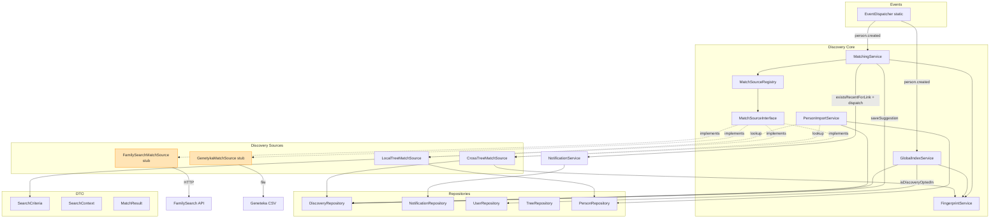
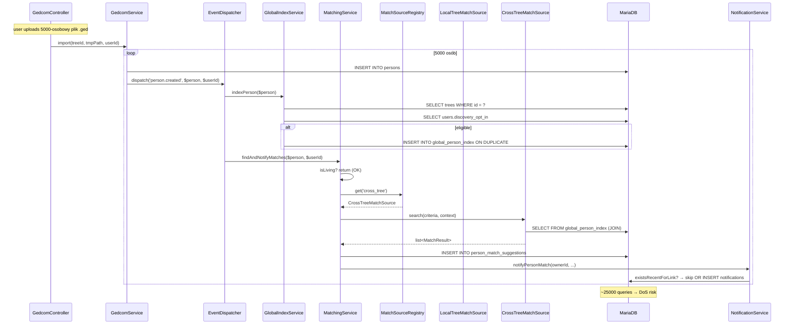

# Audyt architektury — Genealog (backend) — Re-audit #4

**Data:** 2026-04-08

---

## Metryki (zmiany vs backend-3)

| Metryka | backend-3 | backend-4 | Delta |
|---------|-----------|-----------|-------|
| Src files (php) | ~55 | 65 | +10 (nowy moduł Discovery) |
| Services | 17 | 22 | +5 (Discovery/) |
| Controllers | 15 | 15 | 0 |
| Repositories | 8 | 8 | +2 nowe metody |
| Migrations | 11 | 14 | +3 (012, 013, 014) |
| Tests | 5 | 6 | +1 |
| Test coverage szac. | 9% | ~9% | 0 — ZADNYCH testów dla nowego Discovery |
| God classes (>500 LOC) | 1 (GedcomService 775) | 1 | 0 |

### Nowy moduł Discovery — metryki

| Komponent | LOC | Ocena |
|-----------|-----|-------|
| MatchSourceInterface.php | ~20 | ✅ minimalny, 3 metody |
| MatchSourceRegistry.php | ~30 | ✅ clean registry |
| MatchingService.php | 189 | ✅ OK |
| GlobalIndexService.php | 215 | ⚠️ większy, wymaga refactoringu |
| FingerprintService.php | 145 | ✅ OK |
| PersonImportService.php | 113 | ✅ OK |
| LocalTreeMatchSource.php | ~100 | ✅ |
| CrossTreeMatchSource.php | ~180 | ✅ |
| FamilySearchMatchSource.php | ~60 | ✅ (stub) |
| GenetykaMatchSource.php | ~50 | ✅ (stub) |
| DTO classes (3) | ~90 | ✅ |

**Summa Discovery:** ~1200 LOC / 11 plików. Dobrze rozłożony — brak god classes.

---

## Component Diagram — Discovery module



Zielone = pełna implementacja. Pomarańczowe = stuby (isAvailable() false).

---

## Sequence Diagram — person.created event (bulk GEDCOM import scenario)



**Red flag:** Per osoba = 4-6 queries. 5000 osób = 25000-30000 queries w jednym HTTP request. Rate limit GEDCOM = 5/h → 125-150k queries/h per IP. **To jest realny DoS vector.**

---

## Bottlenecks — nowe vs odziedziczone

### Nowe (Discovery)

**N1 — Synchroniczny EventDispatcher w `person.created`** (P1 z audyt-cyber)
- Plik: `public/index.php:136-139`
- Impact: **HIGH** — blokuje request przy masowym GEDCOM import
- Fix: batch event `tree.imported` zamiast per-person, lub async job queue

**N2 — `reindexTree` N+1 queries** (P3 z audyt-cyber)
- Plik: `GlobalIndexService.php:148-154`
- Impact: **HIGH** — 10 000+ queries per request dla 5000-person tree
- Fix: cache `$tree` i `$isOptedIn` raz + `set_time_limit(300)` + chunking

**N3 — Brak `timeout` w MatchSourceInterface** (P5 z audyt-cyber)
- Impact: **MEDIUM** — obecnie stuby, ale dług architektoniczny
- Fix: `getTimeoutSeconds()` w interface

**N4 — `isAvailable()` brak cache** (D4 z audyt-cyber)
- Impact: **LOW-MEDIUM** (HIGH przy HTTP health check)
- Fix: memoization w registry

### Odziedziczone z backend-3 (wciąż aktualne, nie naprawione)

**B1 — GedcomService tmpPath** — NAPRAWIONE w backend-3 (register_shutdown_function) ✅

**B2 — brak indeksu `persons(tree_id, gedcom_xref)`** — NAPRAWIONE w backend-3 (migration 012) ✅

**B3 — `buildPersonHierarchy` rekurencja** — NAPRAWIONE w backend-3 (MAX_HIERARCHY_DEPTH=20) ✅

**B4 — `AdminRepository::getStats()` 5 COUNT bez cache** — NIE naprawione
- Impact: Medium, admin traffic niski, można odroczyć

**B5 — RateLimiter 2 queries/request** — NIE naprawione (odroczone do Redis)

**B6 — PHP file sessions** — NIE naprawione (odroczone)

### Nowy bottleneck — testy

**N5 — Brak testów dla Discovery** — **KRYTYCZNE z perspektywy quality**
- 0 testów dla MatchingService, PersonImportService, FingerprintService, Sources
- Zmiana algorytmu fingerprint = wszystkie hashe w global_person_index stają się nieważne
- Regresje wykryją dopiero przez audyt, nie CI

---

## Coupling & Cohesion — Discovery module

### Plusy (+)

**Loose coupling (wzorcowy OCP):**
- Sources implementują `MatchSourceInterface` — dodanie nowej = `register()` w `public/index.php`
- MatchingService zna tylko interface, nie konkretne klasy
- DTOs separated — SearchCriteria (input), SearchContext (auth info), MatchResult (output)
- Registry pattern umożliwia testowanie (DI-friendly)

**Exception isolation:**
- `try/catch(\Throwable) + continue` w `MatchingService::findCandidates` — awaria jednej source nie wywala całości

**Repository pattern:**
- `NotificationRepository::existsRecentForLink` i `UserRepository::isDiscoveryOptedIn` — dedykowane metody zamiast raw SQL w serwisach (clean separation)

### Minusy (-)

**Circular dependency risk:**
- `GlobalIndexService` + `MatchingService` + `PersonImportService` — wszystkie używają `PersonRepository`, `TreeRepository`, `DiscoveryRepository`, `UserRepository`. Risk: kolejne services mogą zacząć ciągnąć z siebie nawzajem.

**Hardcoded strings w MatchingService:**
```php
if ($name === 'local') { ... }
elseif ($name === 'cross_tree') { ... }
default => 'external'
```
Duplikacja źródła prawdy. Fix: stałe w interface lub enum.

**Brak DI dla `EventDispatcher`:**
Static calls `EventDispatcher::on(...)` w bootstrap. Test mocking bardzo trudny.

---

## Testability — stan obecny

| Komponent | Testy | Możliwość testowania |
|-----------|-------|----------------------|
| MatchingService | ❌ | ✅ (mockable: registry + services) |
| PersonImportService | ❌ | ✅ (mockable: repositories) |
| FingerprintService | ❌ | ✅ (pure function — prosty test!) |
| MatchSourceRegistry | ❌ | ✅ (zero-dep) |
| LocalTreeMatchSource | ❌ | ⚠️ (wymaga DB mock) |
| CrossTreeMatchSource | ❌ | ⚠️ (wymaga DB mock) |
| FamilySearchMatchSource | ❌ | ⚠️ (wymaga HTTP mock — curl wrapper needed) |
| GlobalIndexService | ❌ | ⚠️ (wymaga DB) |

**Priority 1:** `FingerprintService` — 1 test file, ~30 minut pracy, ogromny value (regression protection).
**Priority 2:** `MatchingService` — z mocked registry.
**Priority 3:** `PersonImportService` — z mocked repositories.

---

## Rekomendacje scalability (Discovery)

### Krótkoterminowe (pre-deploy)

1. **Batch event dla bulk GEDCOM import** (N1)
   - `GedcomService` po zakończeniu import emituje 1× `tree.imported`
   - Handler: `MatchingService::reindexAndMatchTree($treeId)` — RAZ, nie N razy

2. **Cache tree + user opt-in w reindexTree** (N2)
   ```php
   public function reindexTree(string $treeId): void
   {
       $tree = $this->treeRepo->findById($treeId);
       $optedIn = $this->userRepo->isDiscoveryOptedIn($tree->ownerId);
       if (!$optedIn) return; // early exit

       @set_time_limit(300);
       foreach ($persons as $person) {
           $this->indexPersonInternal($person, $tree, $optedIn);
       }
   }
   ```

3. **Progress reporting dla reindexTree UI** — flush output co 100 osób

### Średnioterminowe (post-MVP)

4. **APCu cache w MatchSourceRegistry** — `getEnabled()` cached for request lifetime
5. **Circuit breaker dla external sources** — 3 consecutive failures → auto-disable 5min
6. **Monitoring: matching latency percentiles** — P50/P95/P99 dla `findAndNotifyMatches`

### Długoterminowe (backend-2 Faza 3 odroczone)

7. **Async job queue** — `async_jobs` table + worker. Discovery staje się async.
8. **Redis session handler** — horizontal scaling
9. **DI Container activation** — `Container.php` z lazy bindings
10. **GedcomService split** — Parser/Importer/Exporter

---

## Schemat Data Flow — z trust boundaries

```mermaid
flowchart LR
  subgraph Internet [Trust: Internet]
    USER[User Browser]
    FS_API[FamilySearch API USA]
    GEN_FILE[Geneteka CSV]
  end

  subgraph Process [Trust: PHP process]
    IDX[index.php bootstrap]
    MW[AuthMiddleware]
    CTL[Controllers]
    SVC[Services + Discovery/]
    REPO[Repositories]
    ED_STATIC[EventDispatcher static]
  end

  subgraph Storage [Trust: Server FS]
    MEDIA[storage/media/]
    GENSTORE[storage/geneteka/ TBD]
    TMP[/tmp GEDCOM → shutdown cleanup/]
  end

  subgraph DB [Trust: MariaDB]
    USERS[users]
    TREES[trees]
    PERSONS[persons]
    GI_IDX[global_person_index]
    AUDIT[source_audit_log]
  end

  USER -->|HTTPS + cookie| IDX
  IDX --> MW --> CTL --> SVC --> REPO
  REPO -->|PDO prepared| DB

  CTL -.person.created.-> ED_STATIC
  ED_STATIC -.sync.-> SVC

  SVC -->|outbound HTTPS| FS_API
  SVC -->|file read| GEN_FILE
  SVC -->|file ops| MEDIA
  SVC -->|tmpPath| TMP

  FS_API -.crosses boundary.-> SVC
  GEN_FILE -.crosses boundary.-> SVC

  classDef external fill:#ffe4b5,stroke:#ff8c00;
  class FS_API,GEN_FILE external;
```

**Nowe trust boundary crossings (vs backend-3):**
- FamilySearch API (USA) — **wymaga mechanizmu transferu** (SCC) — patrz K2 audyt-cyber
- Geneteka CSV (local file — ale wymaga walidacji ścieżki, patrz P11)

---

## Ocena architektury: PASS WITH CONDITIONS

**Plusy:**
- Pluggable MatchSource architecture = **wzorcowy OCP**
- Interface minimalny, DTO czyste, Registry testowalny
- Exception isolation per source
- Repository pattern dla dedykowanych metod
- Privacy by design w cross_tree (HMAC + immutable snapshot)
- Optimistic lock w PersonImportService

**Minusy:**
- Synchroniczny EventDispatcher → DoS vector przy bulk import
- `reindexTree` N+1 + brak timeoutu
- Brak timeout w MatchSourceInterface (dług arch.)
- Zero testów dla Discovery (quality risk)
- Hardcoded strings zamiast stałych

**Werdykt:** Architektura nowego modułu Discovery jest **zdrowa i elegancka**, pluggable design jest wzorowy. Wymaga 4 poważnych napraw (P1, P3, P5, i zduplikowane w audyt-cyber) przed deploymentem z prawdziwym obciążeniem. Długoterminowe zmiany (async jobs) stają się blokerami w momencie aktywacji FamilySearch/Geneteka.
