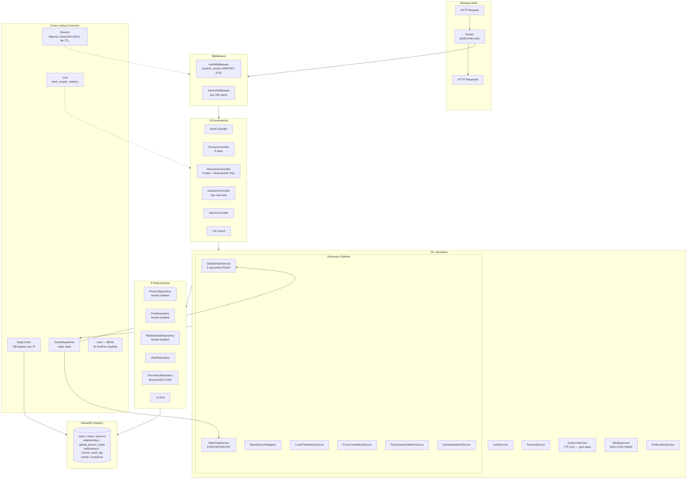
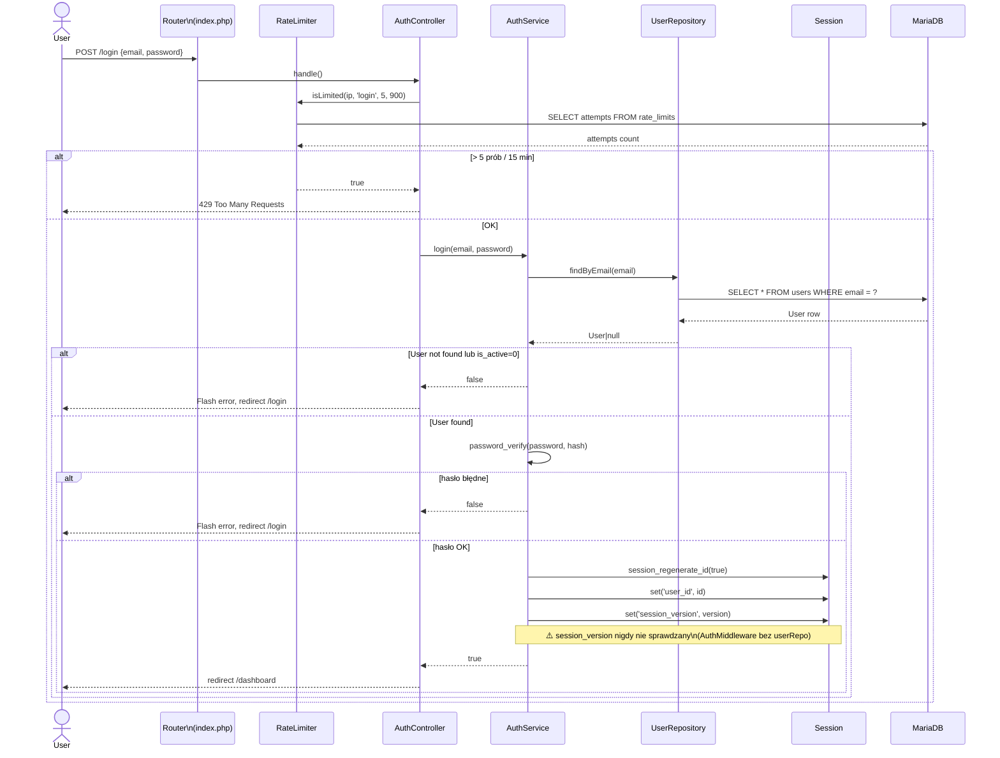
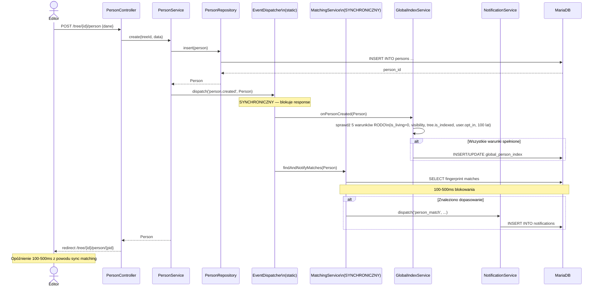
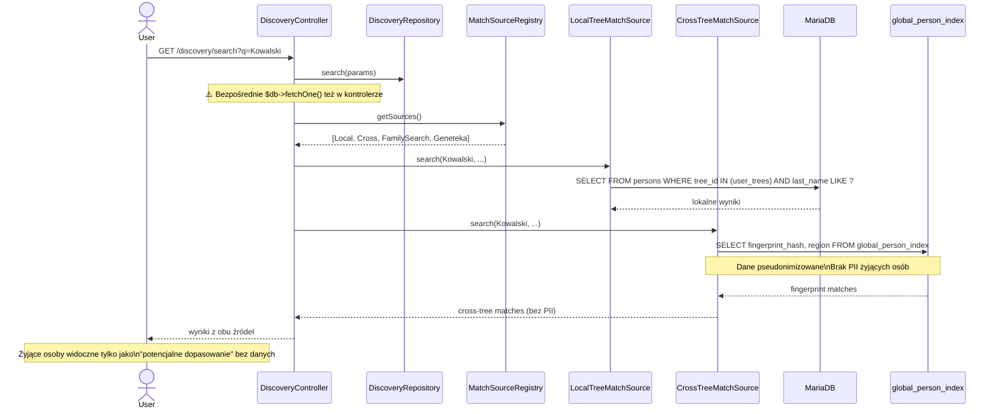

# Audyt architektury — Genealog Backend
**Data:** 2026-04-07 | **Scope:** Component diagram, sequence diagrams, coupling/cohesion, scalability
**Narzędzia:** PHP 8.2 MVC bez frameworka, MariaDB, PDO, natywne sesje

---

## 1. Diagram komponentów

**Legenda problemów:**
- Czerwone: `MARTWY KOD`, `god class`, `SYNCHRONICZNY`, `bezpośredni SQL`
- Żółte: `9 deps`, `brak rate limit`, `bez DB check`

---

## 2. Diagram sekwencji — Logowanie użytkownika

---

## 3. Diagram sekwencji — Dodanie osoby z EventDispatcher

---

## 4. Diagram sekwencji — Cross-tree Discovery

---

## 5. Metryki coupling/cohesion

### Zależności kontrolerów (Fan-In / Fan-Out)

| Kontroler | Zależności (Fan-Out) | Ocena |
|-----------|---------------------|-------|
| PersonController | 9 deps | Wysoki — jednorodny (CRUD osoby) |
| DiscoveryController | 9 deps + bezpośredni SQL | Wysoki — **niejednorodny** |
| AdminController | ~7 deps | Akceptowalny |
| AuthController | ~4 deps | Dobry |
| GedcomController | ~5 deps | Akceptowalny |
| InvitationController | ~4 deps | Dobry |

### Dependency Injection — brak kontenera DI

`public/index.php` tworzy ~25 obiektów ręcznie. Problemy:
1. Brak lazy loading — wszystkie serwisy tworzone przy każdym requeście.
2. Trudny do testowania bez zamiany zależności (mock).
3. Błąd konfiguracji (AuthMiddleware bez userRepo) łatwy do popełnienia i trudny do wykrycia.

Dla obecnej skali projektu akceptowalne. Przy wzroście do >20 kontrolerów — rozważyć lekki kontener DI (PHP-DI lub własny).

---

## 6. Bottlenecki wydajnościowe

### B1 — MatchingService synchroniczny (HIGH)
Wywołanie `MatchingService::findAndNotifyMatches()` blokuje response o 100-500ms przy każdym dodaniu osoby. Przy dużej bazie global_index — ryzyko timeoutu.

**Rozwiązanie:** Przenieść do asynchronicznego job queue (tabela `async_jobs`) lub przynajmniej wykonywać po wysłaniu response przez `fastcgi_finish_request()` / output buffering trick.

### B2 — GlobalIndexService::reindexTree synchroniczny (HIGH)
Reindeksacja całego drzewa wykonywana w ramach HTTP request. Przy drzewie 1000+ osób — timeout webservera.

**Rozwiązanie:** Job queue + endpoint statusu reindexacji.

### B3 — RateLimiter — SELECT+INSERT per request (MEDIUM)
Każdy request do chronionych endpointów wykonuje 2 zapytania do bazy danych. Przy dużym ruchu — wąskie gardło.

**Rozwiązanie:** Redis jako backend RateLimiter (atomic INCR + EXPIRE).

### B4 — GedcomService::import bez limitów (MEDIUM)
Brak `set_time_limit()`, brak limitu liczby rekordów. Import pliku 50MB z 100 000 osób może blokować serwer przez minuty.

**Rozwiązanie:** Limit rekordów per request (np. 5000), job queue dla dużych plików, progress tracking.

### B5 — Sesje plikowe (LOW przy MVP)
Natywne sesje PHP używają blokady pliku (file lock). Przy >100 równoczesnych użytkowników — lock contention dla sesji tego samego użytkownika (np. AJAX requests).

**Rozwiązanie długoterminowe:** Redis session handler (`session.save_handler = redis`).

---

## 7. Ocena gotowości na skalowanie horyzontalne

| Aspekt | Status | Uwagi |
|--------|--------|-------|
| Baza danych | Gotowe | MariaDB w Dockerze, łatwy deploy na dedykowany host |
| Sesje | Niegotowe | Plikowe sesje — nie działają multi-node |
| Rate limiting | Niegotowe | DB-backed — nie synchronizuje się między węzłami |
| Pliki mediów | Niegotowe | Lokalny storage — wymaga S3/NFS dla multi-node |
| EventDispatcher | Niegotowe | Static state — nie działa w multi-process |
| Kod aplikacji | Gotowe | Bezstanowe handlery HTTP |
| Matching async | Niegotowe | Synchroniczny blokuje response |

**Wniosek:** Aplikacja skrojona pod single-server deployment — odpowiednia dla MVP. Przed skalowaniem horyzontalnym wymagane: Redis sessions, Redis rate limiter, S3/NFS storage, async job queue.

---

## 8. Rekomendacje architektoniczne (priorytet)

| ID | Rekomendacja | Effort | Priorytet |
|----|-------------|--------|-----------|
| A1 | Async EventDispatcher dla person.created (job queue w DB) | L | HIGH |
| A2 | Redis session handler | S | HIGH |
| A3 | Rate limit `/invite/{token}` — brak ochrony | XS | MEDIUM |
| A4 | Podział DiscoveryController na DiscoverySettingsController + DiscoveryApiController | M | MEDIUM |
| A5 | Audit log dla GedcomController::import do source_audit_log | XS | MEDIUM |
| A6 | Limit rekordów GEDCOM + set_time_limit(300) | M | MEDIUM |
| A7 | GEDCOM export filtrować is_living=1 (nie eksportować żyjących) | S | HIGH |
| A8 | Rate limit dla photo upload per-user | XS | LOW |
| A9 | Ekstrakcja Uuid::generate() — DRY fix | XS | HIGH |
| A10 | src/Core/DI — prosty kontener dependency injection | L | LOW |
